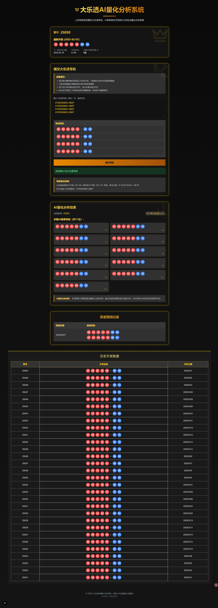
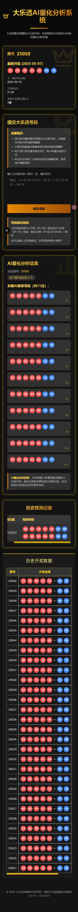

# 大乐透智能分析预测 / Super Lotto AI Analysis & Prediction

## 简介 / Introduction

**中文：**
本项目是一个大乐透彩票的分析和预测工具，旨在通过历史数据分析和 AI 智能算法，为用户提供数据参考和趋势预测，辅助用户进行决策。

**English:**
This project is an analysis and prediction tool for the Super Lotto lottery. It aims to provide users with data references and trend predictions through historical data analysis and AI intelligent algorithms to assist users in decision-making.



## 主要功能 / Key Features

**中文：**

- 历史数据展示：清晰展示往期大乐透的开奖号码、中奖情况等。
- AI 智能预测：基于机器学习算法，对未来的开奖号码进行预测。
- 开奖信息：实时更新最新的开奖结果。
- 新人引导：为新用户提供友好的使用指引和功能介绍。

**English:**

- Historical Data Display: Clearly display past Super Lotto draw numbers, prize information, etc.
- AI Smart Prediction: Predict future draw numbers based on machine learning algorithms.
- Draw Information: Real-time updates of the latest lottery results.
- New User Onboarding: Provide friendly usage guidance and feature introductions for new users.

## 技术栈 / Tech Stack

- Next.js
- React
- TypeScript
- Tailwind CSS
- Node.js (for backend APIs if any)
- Python (for AI/ML models if any)

## 安装与启动 / Setup and Run

**中文：**

```bash
# 安装依赖
npm install

# 启动开发服务器
npm run dev
```

**English:**

```bash
# Install dependencies
npm install

# Start development server
npm run dev
```

## 使用说明 / Usage

**中文：**

1.  通过导航栏访问不同的功能模块，如“历史数据”、“AI 预测”等。
2.  在“历史数据”中查看往期开奖详情。
3.  在“AI 预测”中获取基于算法的号码建议。
4.  关注“开奖信息”获取最新结果。

**English:**

1.  Access different functional modules such as "Historical Data", "AI Prediction", etc., through the navigation bar.
2.  View details of past draws in "Historical Data".
3.  Get algorithm-based number suggestions in "AI Prediction".
4.  Follow "Draw Information" for the latest results.

## 使用 Nginx 实现横向扩容 / Horizontal Scaling with Nginx

**中文：**

对于涉及大量 I/O 操作和内存操作的 API 后端，横向扩容是提高系统吞吐量和可用性的关键策略。通过 Nginx 作为负载均衡器，可以将请求分发到多个后端服务器实例，从而分散负载并提高整体性能。

### 方案重点

本方案专注于为以下类型的 API 后端提供负载均衡：

- **I/O 密集型 API**：例如，处理文件上传下载、数据库大量读写、外部服务调用的 API。
- **内存密集型 API**：例如，进行复杂计算、缓存大量数据、处理大数据集的 API。

在本项目 `daletou` 中，以下 API 路由是应用此横向扩容方案的典型例子：

- **`/api/history`**：此接口用于获取历史开奖数据。当数据量较大时，查询和处理这些数据（可能来自数据库或大型文件）会成为 I/O 密集型操作，并可能消耗较多内存来缓存和序列化结果。
- **`/api/stats`**：此接口用于生成统计数据。它可能需要读取原始数据、执行各种统计计算（如频率分析、趋势预测等），并聚合结果。这些操作，尤其是在处理大量历史数据点时，会显著消耗 CPU 和内存资源。

通过在这些 API 前端部署 Nginx，可以有效地将客户端请求分发到后端的多个应用服务器实例。

通过在这些 API 前端部署 Nginx，可以有效地将客户端请求分发到后端的多个应用服务器实例。

### 会话保持 (粘性会话)

在某些场景下，特别是当 API 后端需要在多个请求之间保持用户状态或利用服务器本地缓存时，会话保持（或称“粘性会话”）变得至关重要。这意味着来自特定客户端的请求应始终被路由到同一台后端服务器。

Nginx 提供了多种实现会话保持的方法，其中最常用的是 `ip_hash` 指令。当使用 `ip_hash` 时，Nginx 会根据客户端的 IP 地址来决定将请求发送到哪个后端服务器。这样可以确保来自同一 IP 地址的请求总是被定向到同一台服务器。

其他方法包括使用 cookie（例如 Nginx Plus 的 `sticky cookie` 指令或开源版本的第三方模块）或基于请求头/参数的自定义哈希。选择哪种方法取决于具体的应用需求和环境。

### Nginx 配置示例

以下是一个结合本项目 `daletou` 特点，使用 `ip_hash` 实现会话保持的 Nginx 配置示例。假设我们的 Next.js 应用实例运行在 `3000` 端口：

```nginx
http {
    # 定义后端 API 服务器组
    upstream api_backend {
        ip_hash; # 基于客户端 IP 地址的会话保持
        server daletou-app-instance1:3000; # 后端 Next.js 应用实例 1
        server daletou-app-instance2:3000; # 后端 Next.js 应用实例 2
        server daletou-app-instance3:3000; # 后端 Next.js 应用实例 3
        # 可以根据需要添加更多服务器
    }

    server {
        listen 80;
        server_name daletou-api.yourproject.com; # 您项目的 API 域名

        # location / { # 通用匹配，可以将所有请求代理到后端
        #     proxy_pass http://api_backend;
        # }

        # 针对本项目中的 /api/history 和 /api/stats 进行负载均衡
        location ~ ^/api/(history|stats) {
            proxy_pass http://api_backend; # 将请求代理到后端服务器组
            proxy_set_header Host $host;
            proxy_set_header X-Real-IP $remote_addr;
            proxy_set_header X-Forwarded-For $proxy_add_x_forwarded_for;
            proxy_set_header X-Forwarded-Proto $scheme;

            # 其他代理相关配置
            proxy_connect_timeout 60s;
            proxy_send_timeout 60s;
            proxy_read_timeout 60s;
        }

        # 可以为其他特定 API 路径配置更细致的规则，如果不是所有 /api/ 下的路径都需要负载均衡
        # location /api/another-specific-path/ {
        #     # ... 特定配置
        #     proxy_pass http://some_other_backend_or_same;
        # }
    }
}
```

**English:**

For API backends involving intensive I/O operations and memory operations, horizontal scaling is a key strategy to improve system throughput and availability. By using Nginx as a load balancer, requests can be distributed across multiple backend server instances, thereby distributing the load and enhancing overall performance.

### Solution Focus

This solution focuses on providing load balancing for the following types of API backends:

- **I/O-intensive APIs**: For example, APIs handling file uploads/downloads, extensive database reads/writes, or calls to external services.
- **Memory-intensive APIs**: For example, APIs performing complex computations, caching large amounts of data, or processing large datasets.

In this `daletou` project, the following API routes are prime candidates for this horizontal scaling solution:

- **`/api/history`**: This endpoint serves historical draw data. Querying and processing this data (potentially from a database or large files) can become I/O-intensive, especially with a large dataset, and may also consume significant memory for caching and serialization.
- **`/api/stats`**: This endpoint generates statistical data. It might involve reading raw data, performing various statistical calculations (like frequency analysis, trend prediction, etc.), and aggregating results. These operations, particularly when processing numerous historical data points, can be CPU and memory-intensive.

By deploying Nginx in front of these APIs, client requests can be effectively distributed to multiple application server instances in the backend.

By deploying Nginx in front of these APIs, client requests can be effectively distributed to multiple application server instances in the backend.

### Session Persistence (Sticky Sessions)

In some scenarios, especially when the API backend needs to maintain user state across multiple requests or leverage server-local caching, session persistence (or "sticky sessions") becomes crucial. This means that requests from a specific client should always be routed to the same backend server.

Nginx offers several methods to achieve session persistence, with the `ip_hash` directive being one of the most common. When `ip_hash` is used, Nginx determines which backend server to send the request to based on the client's IP address. This ensures that requests from the same IP address are always directed to the same server.

Other methods include using cookies (e.g., the `sticky cookie` directive in Nginx Plus or third-party modules for the open-source version) or custom hashing based on request headers/parameters. The choice of method depends on specific application requirements and the environment.

### Nginx Configuration Example

Below is an Nginx configuration example tailored for our `daletou` project, using `ip_hash` for session persistence. This assumes our Next.js application instances run on port `3000`:

```nginx
http {
    # Define the backend API server group
    upstream api_backend {
        ip_hash; # Session persistence based on client IP address
        server daletou-app-instance1:3000; # Backend Next.js application instance 1
        server daletou-app-instance2:3000; # Backend Next.js application instance 2
        server daletou-app-instance3:3000; # Backend Next.js application instance 3
        # Add more servers as needed
    }

    server {
        listen 80;
        server_name daletou-api.yourproject.com; # Your project's API domain name

        # location / { # Generic match, can proxy all requests to the backend
        #     proxy_pass http://api_backend;
        # }

        # Load balance requests for /api/history and /api/stats in this project
        location ~ ^/api/(history|stats) {
            proxy_pass http://api_backend; # Proxy requests to the backend server group
            proxy_set_header Host $host;
            proxy_set_header X-Real-IP $remote_addr;
            proxy_set_header X-Forwarded-For $proxy_add_x_forwarded_for;
            proxy_set_header X-Forwarded-Proto $scheme;

            # Other proxy-related configurations
            proxy_connect_timeout 60s;
            proxy_send_timeout 60s;
            proxy_read_timeout 60s;
        }

        # More granular rules can be configured for other specific API paths
        # if not all paths under /api/ require load balancing
        # location /api/another-specific-path/ {
        #     # ... specific configurations
        #     proxy_pass http://some_other_backend_or_same;
        # }
    }
}
```


